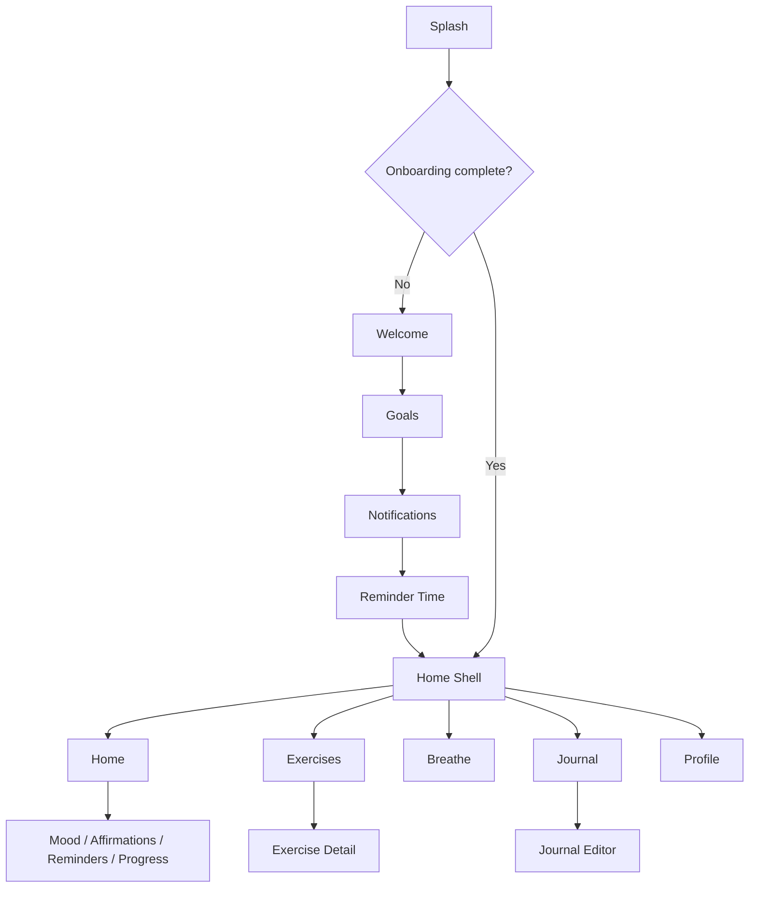

# Desk Wellness — Product Specification

**Project:** `desk_wellness` (display name: Desk Wellness)  
**Version:** 1.0.0 MVP  
**Stack:** Flutter · Riverpod · GetIt · GoRouter · Drift · SQLite

---

## 1. Product Overview

Desk Wellness is a **premium, offline-first wellness app** for people who sit for long hours—office workers, developers, students, and remote professionals. It helps users improve posture, reduce stress, stay focused, and build healthier work habits through guided desk exercises, breathing sessions, affirmations, journaling, mood tracking, and local reminders.

**Core principles:**
- 100% serverless — no auth, no cloud DB, no REST APIs
- All data stays on device (SQLite + SharedPreferences for tiny flags)
- Apple HIG–inspired UI: minimal, pastel, spacious, dark-mode ready
- AI-ready architecture via swappable `AIService` (mock today)

---

## 2. User Personas

| Persona | Need | Primary features |
|---------|------|------------------|
| **Alex — Software Engineer** | Neck/back pain from 10h desk days | Exercise library, stretch reminders |
| **Morgan — Product Designer** | Eye strain, creative fatigue | Eye breaks, breathing, affirmations |
| **Jordan — MBA Student** | Stress + long study sessions | Mood tracker, journal, focus breathing |
| **Sam — Remote PM** | Irregular breaks, low energy | Home dashboard, water tracking, streaks |
| **Riley — Freelance Writer** | Isolation, motivation dips | Affirmations, journal, weekly progress |

---

## 3. Feature Breakdown

| # | Feature | Status (MVP) | Storage |
|---|---------|--------------|---------|
| 1 | Home dashboard | ✅ Implemented | Aggregated from DB |
| 2 | Exercise library (9 categories) | ✅ Seed + UI | `Exercises`, `ExerciseCategories` |
| 3 | Exercise detail + timer | ✅ | `ExerciseHistories` |
| 4 | Daily affirmations | ✅ CRUD + favorites | `Affirmations` |
| 5 | Guided breathing | ✅ Animated circle | `BreathingHistories` |
| 6 | Mood tracker + charts | ✅ fl_chart weekly | `Moods` |
| 7 | Journal | ✅ List + editor | `JournalEntries` |
| 8 | Reminder center | ✅ Basic + notifications | `Reminders` |
| 9 | Progress + achievements | ✅ | `DailyProgresses`, `Achievements` |
| 10 | Profile / settings | ✅ Theme, reset, about | `UserSettings` |

**Future (not in MVP):** wallpaper export, markdown preview, full backup/import, premium paywall.

---

## 4. User Journey

### First launch
```
Splash → Welcome → Select Goals → Notification Permission → Reminder Time → Home
```

### Return launch
```
Splash → Home (5-tab shell)
```

No login, no account creation, no network dependency.

---

## 5. Information Architecture

```
Desk Wellness
├── Onboarding (first run only)
├── Main Shell
│   ├── Home
│   ├── Exercises → Exercise Detail
│   ├── Breathe
│   ├── Journal → Editor
│   └── Profile
└── Modal / Push routes
    ├── Mood Tracker
    ├── Affirmations
    ├── Reminders
    └── Progress
```

---

## 6. Complete Screen List

| Screen | Route | Tab |
|--------|-------|-----|
| Splash | `/splash` | — |
| Welcome | `/onboarding/welcome` | — |
| Goals | `/onboarding/goals` | — |
| Notifications | `/onboarding/notifications` | — |
| Reminder time | `/onboarding/reminder` | — |
| Home | `/home` | 🏠 |
| Exercise library | `/exercises` | 🏃 |
| Exercise detail | `/exercise/:id` | — |
| Breathing | `/breathe` | 🧘 |
| Journal list | `/journal` | 📖 |
| Journal editor | `/journal/new` | — |
| Profile | `/profile` | 👤 |
| Mood tracker | `/mood` | — |
| Affirmations | `/affirmations` | — |
| Reminders | `/reminders` | — |
| Progress | `/progress` | — |

---

## 7. Navigation Flow



**Implementation:** `GoRouter` + `StatefulShellRoute.indexedStack` in `lib/app/router.dart`.

---

## 8. SQLite Database Schema

**ORM:** Drift · **File:** `desk_wellness.sqlite` · **Schema version:** 1

| Table | PK | Key columns | Relations |
|-------|----|-------------|-----------|
| `exercise_categories` | id | slug, name, sort_order | — |
| `exercises` | id | slug, title, category_id, duration_seconds, difficulty | FK → categories |
| `exercise_histories` | id | exercise_id, completed_at, duration_seconds | FK → exercises |
| `affirmations` | id | content, category, is_favorite, is_custom | — |
| `moods` | id | mood/stress/energy/sleep levels, notes, recorded_at | — |
| `journal_entries` | id | title, body, tags, mood_id, is_favorite | FK → moods (nullable) |
| `reminders` | id | type, title, time_of_day, enabled, days_of_week | — |
| `achievements` | id | slug, title, is_unlocked, unlocked_at | — |
| `daily_progresses` | id | date (unique), wellness_score, streak_day, counters | — |
| `user_settings` | id | onboarding_complete, goals, theme_mode, reminder time | — |
| `water_trackings` | id | date, glasses | — |
| `breathing_histories` | id | pattern, duration_seconds, completed_at | — |
| `favorites` | id | entity_type, entity_id | polymorphic |

**Indexes (recommended v2):** `exercise_histories.completed_at`, `moods.recorded_at`, `journal_entries.updated_at`.

**Migrations:** Bump `schemaVersion` in `app_database.dart`; add `MigrationStrategy` steps.

---

## 9. Folder Structure

```
lib/
├── app/                 # App widget, GoRouter
├── core/
│   ├── di/              # GetIt registration
│   ├── services/        # AIService, NotificationService
│   ├── theme/           # AppColors, ThemeData
│   └── widgets/         # Shared UI (cards, buttons)
├── database/            # Drift tables, seed, app_database
├── repositories/        # Domain data access
├── features/
│   ├── onboarding/
│   ├── home/
│   ├── exercise/
│   ├── breathing/
│   ├── journal/
│   ├── mood/
│   ├── affirmation/
│   ├── reminders/
│   ├── progress/
│   └── profile/
└── shared/providers/    # Riverpod repository providers
```

---

## 10. UI Design System

**Typography:** Inter (Google Fonts) — display 32/28, title 22/18, body 16/14, caption 12.

**Color palette (light):**
- Background `#F7F8FC`, Surface `#FFFFFF`
- Primary `#6B7FD7`, Secondary `#9B8FD9`
- Success `#4CB894`, Warning `#E8A84C`
- Text primary `#1A1D26`, secondary `#5C6370`

**Spacing:** 4 · 8 · 12 · 16 · 24 · 32 · 48 (base unit 4px).

**Radius:** cards 20, buttons 14, chips 10.

**Shadows:** soft `blur 24, y 8, opacity 0.06`.

**Dark mode:** mirrored tokens in `AppColors.dark`.

---

## 11. Component Library

| Component | File | Usage |
|-----------|------|-------|
| `AppCard` | `core/widgets/app_widgets.dart` | Dashboard sections |
| `PrimaryButton` | same | CTAs |
| `EmptyState` | same | Zero-data screens |
| `SectionHeader` | same | List section titles |
| Theme extension `AppColors` | `core/theme/app_theme.dart` | `context.colors` |

---

## 12. State Management Strategy

| Layer | Tool | Responsibility |
|-------|------|----------------|
| DI singletons | **GetIt** | DB, repositories, services |
| UI state / streams | **Riverpod** | `repository_providers.dart`, `routerProvider` |
| Local widget state | `StatefulWidget` | Timers, form fields |

**Pattern:** Screen → `ref.watch(repoProvider)` → Repository → Drift.

State management uses Riverpod (not BLoC).

---

## 13. Repository Layer

| Repository | Key methods |
|------------|-------------|
| `SettingsRepository` | `watchSettings()`, `completeOnboarding()`, `setTheme()` |
| `ExerciseRepository` | `watchExercises()`, `getById()`, `markComplete()` |
| `AffirmationRepository` | `watchAll()`, `todayAffirmation()`, `addCustom()` |
| `JournalRepository` | `watchAll()`, `save()`, `delete()` |
| `MoodRepository` | `watchRecent()`, `logMood()` |
| `BreathingRepository` | `recordSession()` |
| `ReminderRepository` | `watchAll()`, `addDefaultBreakReminder()` |
| `WaterRepository` | `todayGlasses()`, `addGlass()` |
| `ProgressRepository` | `wellnessScore()`, `unlockAchievement()` |

---

## 14. Local Storage Strategy

| Data | Store |
|------|-------|
| All structured data | Drift / SQLite |
| Onboarding, goals, theme | `user_settings` table |
| Optional tiny flags | SharedPreferences (if added) |
| Assets | Bundled GIFs, Lottie, icons |

**Privacy:** No telemetry, no PII leaves device.

---

## 15. Notification Flow

1. Onboarding → user grants permission via `NotificationService.requestPermission()`
2. Reminder time saved → `ReminderRepository.addDefaultBreakReminder(time)`
3. `NotificationService.scheduleDaily()` registers repeating local notification
4. In-app "Reminders" screen toggles `enabled` flag

**Channel:** `wellness_reminders` (Android) · iOS alert permission string in Info.plist.

---

## 16. Future AI Integration Plan

```dart
abstract class AIService {
  Future<String> dailyInsight(...);
  Future<String> moodInsight(...);
  Future<String> journalPrompt(...);
}
```

**Today:** `MockAIService` (deterministic copy).  
**Later:** Implement `OpenAIService`, `GeminiAIService`, etc.; register in `configureDependencies()`. UI reads only `AIService` interface.

**Guard:** Optional `AiFeatures.enabled` flag before showing AI sections.

---

## 17. Future Premium Features (do not implement)

- Cloud sync (encrypted backup)
- Custom exercise video packs
- AI posture scan (on-device ML)
- Team / workplace wellness dashboards
- Apple Watch companion
- Widgets + Live Activities

---

## 18. UX Improvements (post-MVP)

- Streak celebration Lottie on milestone days
- Haptic feedback on timer complete
- Smart break suggestions based on mood + calendar (local heuristics)
- Onboarding tooltips on first home visit
- Pull-to-refresh on progress charts

---

## 19. Accessibility

- Minimum touch target 44×44
- Semantic labels on icon-only buttons
- Respect system text scale
- Sufficient contrast (WCAG AA) for primary text
- Reduce motion: respect `MediaQuery.disableAnimations`

---

## 20. Edge Cases

| Case | Behavior |
|------|----------|
| First launch, DB empty | Seed categories, exercises, affirmations, achievements |
| Notification denied | App works; reminders screen shows enable CTA |
| Reset all data | Clear tables, re-seed defaults |
| Exercise timer backgrounded | Timer pauses (MVP); v2 use background isolate |
| Duplicate water log same day | Upsert increments `glasses` |
| No mood data | Chart shows empty state + CTA |
| Drift migration failure | Log error; offer reset (v2) |

---

## Quick start

```bash
cd /Users/qasimq/development/desk_wellness
flutter pub get
dart run build_runner build --delete-conflicting-outputs
flutter run
```

**Bundle IDs:** `com.intellig.deskwellness.desk_wellness`  
**Display name:** Desk Wellness
